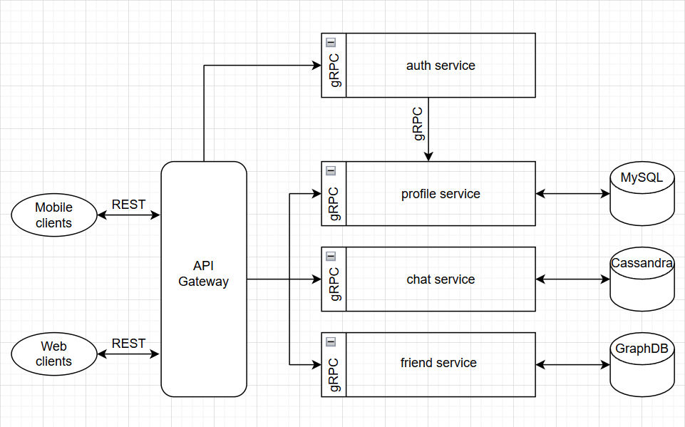

# SimpleMessenger
Реализация простого мессенджера в рамках курса по микро-сервисной архитектуре.

Пока что не понятно как все должно работать изнутри.
Предварительно архитектура следующая:

API Gateway осуществляет роутинг клиентских запросов к соответствующим сервисам бэкенда, а также отвечает за аутентикацию и авторизацию пользователей.

Бэкенд представлен тремя микросервисами:
* Profiles management - работает с профилями пользователей, данные о пользователях хранит в MySql
  * регистрация нового пользователя
  * редактирование профиля пользователя
  * поиск пользователя по никнейму
* Friends management - отвечает за работу с друзьями пользователя, данные хранит в MySql (может быть стоит рассмотреть графовую БД)
  * добавление пользователя в друзья
  * удаление пользователя из друзей
  * подтверждение/отклонение запроса в друзья
  * просмотр списка своих друзей (в том числе неподтвержденных)
* Messages manager - обеспечивает обработку сообщений пользователей, данные хранит в MySql
  * написать сообщение другу
  * получить сообщение из чата с пользователем

Протокол взаимодействия между клиентами и API Gateway, а также между шлюзом и микросервисами - преимущественно REST.

Сервис сообщений видимо будет подписан на события о входе пользователя в мессенджер. При получении события сервис должен отправить пользователю новые сообщения.
Аналогичным образом сервис управления друзьями при получении события о входе пользователя должен отправить ему новые запросы на дружбу.
Для этих целей видимо придется использовать какой-то брокер сообщений.

Аналитика данных в проекте не требуется, быстро читать большие объемы данных по полям не нужно. Для хранения данных о пользователях, сообщениях и друзьях возможностей MySql скорее всего будет достаточно (авки можно хранить в виде блоб-объектов).
Возможно для хранения дерева друзей стоит рассмотреть графоориентированную БД.